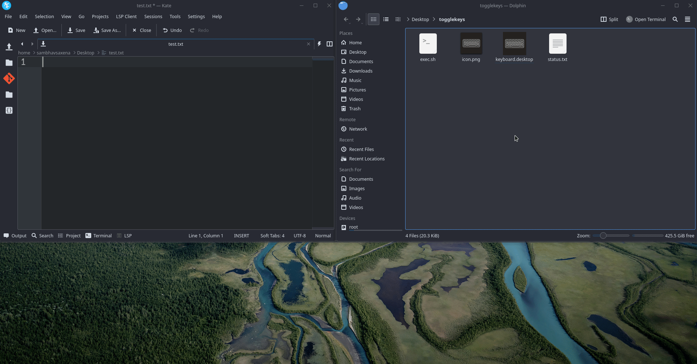

# Shell-utilities
very basic set of utilities for linux users.

## Usage
* Replace the local path in the `.desktop` file and you're good to go.

### Contributing Guide
Raise your pr's i'll merge if its useful. easy.
