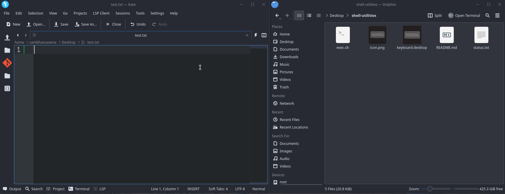

# shell-utilities
Basic set of utilities for linux users.

### 1) Toggle keyboard accessibility

## Usage
* Get the local id for your hardware keyboard by running `xinput` in the terminal.
* Replace this local id in the `exec.sh` file.
* Run `chmod +x exec.sh` in the current directory for granting executable permissions.
* Replace the local path in the `.desktop` file.
* Add the executable to your workspace menubars for easy access.

### 2) Data structure with O(1) time for `n` inputs

So I was working with hash tables and found out that there could be a data structure that could perform insert, delete and find operations in constant time.

Check out [this](code/constantxd.cpp) file for better understanding.

### Contributing Guide
Raise your pr's i'll merge if they're useful. easy.
